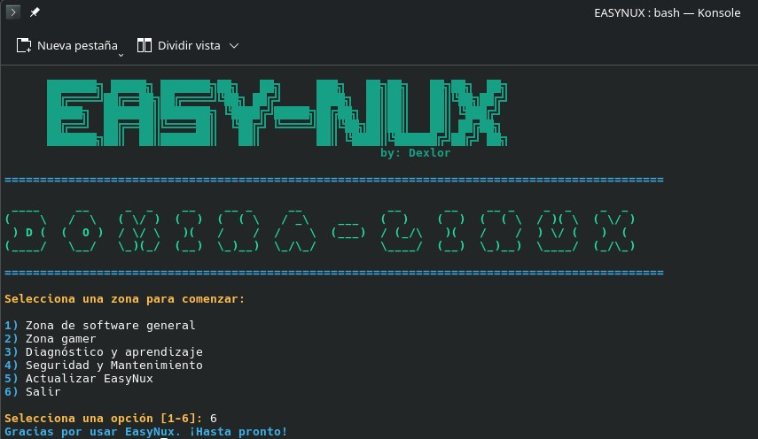

```
███████╗ █████╗ ███████╗██╗   ██╗███╗   ██╗██╗   ██╗██╗  ██╗
██╔════╝██╔══██╗██╔════╝╚██╗ ██╔╝████╗  ██║██║   ██║╚██╗██╔╝
█████╗  ███████║███████╗ ╚████╔╝ ██╔██╗ ██║██║   ██║ ╚███╔╝ 
██╔══╝  ██╔══██║╚════██║  ╚██╔╝  ██║╚██╗██║██║   ██║ ██╔██╗ 
███████╗██║  ██║███████║   ██║   ██║ ╚████║╚██████╔╝██╔╝ ██╗
╚══════╝╚═╝  ╚═╝╚══════╝   ╚═╝   ╚═╝  ╚═══╝ ╚═════╝ ╚═╝  ╚═╝
```

<div align="center">

**Dominá Linux paso a paso 🐧🚀**


*Herramienta interactiva en Bash para usuarios que se inician en Linux.*  
*Automatizá tareas, instalá paquetes y aprendé el sistema desde un menú simple.*

</div>

---

## 📸 Screenshot

### 🟢 Menú principal



---

## ⚡ ¿Qué es EasyNux?

**EasyNux** es una herramienta en Bash pensada para quienes dan sus primeros pasos en Linux. En vez de googlear cada comando o arriesgarse a romper el sistema, EasyNux te ofrece un menú interactivo desde el que podés actualizar, instalar, configurar y aprender — todo en un solo lugar.

---

## 🧠 Funcionalidades

| Módulo | Descripción |
|---|---|
| 🔄 **Actualización del sistema** | Actualizá paquetes con un solo paso |
| 📦 **Herramientas esenciales** | Instalá `wget`, `curl`, `git`, `pip` y más de una vez |
| 🎮 **Drivers y gaming** | Drivers de video + Steam, Lutris y Heroic Games Launcher |
| 📊 **Info del sistema** | Visualizá RAM, CPU, disco y GPU en tiempo real |
| 📚 **Aprendizaje de comandos** | Módulo interactivo para aprender comandos básicos de Linux |
| 🔁 **Auto-actualización** | EasyNux se actualiza solo desde GitHub con detección de cambios locales |

---

## 📦 Instalación

```bash
# 1. Clonar el repositorio
git clone https://github.com/EzeTauil/EasyNux.git
cd EasyNux

# 2. Dar permisos de ejecución
chmod +x easy_nux.sh
chmod +x MODULOS/*.sh

# 3. Ejecutar
./easy_nux.sh
```

---

## 🖥️ Requisitos

- Distribución basada en **Debian / Ubuntu** (Kubuntu, Xubuntu, Linux Mint, etc.)
- Bash 4.0+
- Conexión a internet para instalar paquetes

---

## 📁 Estructura del proyecto

```
EasyNux/
├── easy_nux.sh              # Script principal — menú interactivo
└── MODULOS/                 # Módulos individuales por función
    ├── updateSyst.sh        # Actualización del sistema
    ├── esenciales.sh        # Herramientas esenciales
    ├── optlinuxV2.sh        # Drivers y opciones gaming
    ├── check.sh             # Info del sistema
    ├── comandos.sh          # Módulo de aprendizaje
    └── EasyNuxUP.sh         # Auto-actualización desde GitHub
```

---

## 🔁 Sistema de actualización inteligente

EasyNux detecta si tenés cambios locales en los archivos **antes** de actualizar desde GitHub. Si encontrás modificaciones, te pregunta si querés:

- ✅ **Forzar la actualización** — sobreescribe con la versión más reciente del repo
- ❌ **Cancelar** — conserva tu versión actual sin tocar nada

Así nunca perdés cambios sin querer, pero siempre podés tener EasyNux actualizado con un clic.

---

## ⚠️ Disclaimer

> EasyNux está pensado para entornos de escritorio personales y aprendizaje.  
> Usalo en tu propio sistema. El autor no se responsabiliza por cambios no deseados en el sistema.

---

## 👤 Autor

**Dexlor** — [@EzeTauil](https://github.com/EzeTauil)

---

<div align="center">
<sub>Hecho con 🐧 para hacer Linux más accesible</sub>
</div>
